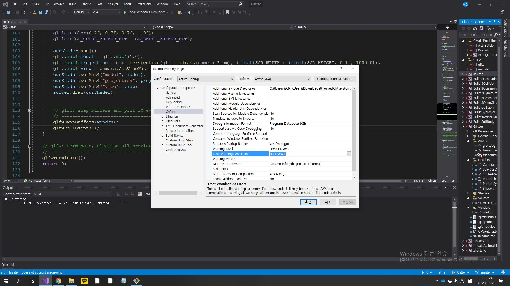

# BVHParser
> September 2018 Jeehon Hyun

This is a simple BVH Parser & Player based on OpenGL and GLFW.

## Demo
https://www.youtube.com/watch?v=dTTWGeY6J64

## How to build and run.
1. Download this repository and go to the ```BVHParser/Build``` directory.
```
git clone --recursive https://github.com/peterhyun/BVHParser.git
cd BVHParser
cd Build
```

If you forgot to use the ```--recursive``` flag while cloning this repository, use the following line to update the submodules:  
```git submodule update --init```

2. Make a project/solution file or makefile depending on your platform. I used Microsoft Windows, Visual Studio 2019.
```
# UNIX Makefile
cmake ..

# Mac OSX
cmake -G "Xcode" ..

# Microsoft Windows
cmake -G "Visual Studio 16 2019" ..
...
```

3. Build the project on your platform accordingly.

While building in the Visual Studio 2019 IDE, ```Treat Warning As Errors``` had to be unticked in the project file property settings for building the Assimp library.


4. Go to the directory ```Build/Glitter/Debug``` run the produced executable file with with the bvh file name you want to load as the command line argument.
```./Glitter $(bvh file name).bvh```

## Directory Structure & Explanation
.  
├── Build/  
├── Glitter/  
│   ├── Assets/  
│   │   ├── README  
│   │   ├── Trial001.bvh  
│   │   ├── Trial002.bvh  
│   │   └── Trial004.bvh  
│   ├── Headers/  
│   │   ├── BVHParser.h  
│   │   ├── BoneForMotionData.h  
│   │   ├── Camera.h  
│   │   └── Shader.h  
│   ├── Shaders/  
│   │   ├── AnimationVertexShader.vs  
│   │   └── AnimationFragmentShader.fs  
│   ├── Sources/  
│   │   └── MotionCapture.cpp  
│   └── Vendor/  
├── screenshots/  
├── CMakeLists.txt  
└── Readme.md  

TBA

The vertex shader and fragment shader are simple glsl code used to render the green model on screen, so I won't go over it here.

## Acknowledgement
The basic OpenGL Setup boilerplate of this code is from Kevin Fung's Glitter repository: https://github.com/Polytonic/Glitter
With this boilerplate, you can test this code in Windows, Linux, or Mac environment. The only dependency it requires is CMake.

-------------------------------------------------------------------------------------------------------------------
## MIT License of the Glitter Boilerplate
>The MIT License (MIT)

>Copyright (c) 2015 Kevin Fung

>Permission is hereby granted, free of charge, to any person obtaining a copy of this software and associated documentation files (the "Software"), to deal in the Software without restriction, including without limitation the rights to use, copy, modify, merge, publish, distribute, sublicense, and/or sell copies of the Software, and to permit persons to whom the Software is furnished to do so, subject to the following conditions:

>The above copyright notice and this permission notice shall be included in all copies or substantial portions of the Software.

>THE SOFTWARE IS PROVIDED "AS IS", WITHOUT WARRANTY OF ANY KIND, EXPRESS OR IMPLIED, INCLUDING BUT NOT LIMITED TO THE WARRANTIES OF MERCHANTABILITY, FITNESS FOR A PARTICULAR PURPOSE AND NONINFRINGEMENT. IN NO EVENT SHALL THE AUTHORS OR COPYRIGHT HOLDERS BE LIABLE FOR ANY CLAIM, DAMAGES OR OTHER LIABILITY, WHETHER IN AN ACTION OF CONTRACT, TORT OR OTHERWISE, ARISING FROM, OUT OF OR IN CONNECTION WITH THE SOFTWARE OR THE USE OR OTHER DEALINGS IN THE SOFTWARE.
